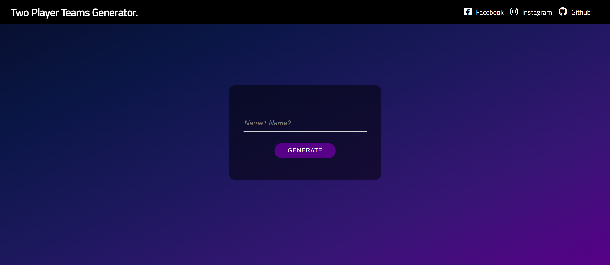
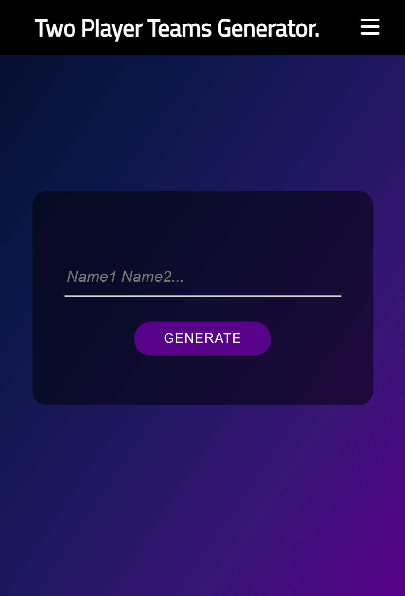

# Team Generator
Team Generator is a web application built with HTML, CSS, and JavaScript that allows users to input a list of player names, shuffle them randomly, and divide them into teams of two players each. The application can be used for a variety of purposes, such as organizing a sports team or assigning partners for a class project.

# How to Use Team Generator
1. Open the [Team Generator](https://kriskoagm.github.io/two-player-team-generator/) website in a web browser.
 
2. Input the names of all the players in the input field.
 
3. Click the "Generate" button to shuffle the names randomly and divide them into teams.
 
4. The resulting teams will be displayed on the page.

# Design

# Important Note
The application can only divide an even number of players into teams of two. If an odd number of players is inputted, the application will prompt the user to add another player before organizing the teams.

# Contributions
If you want to contribute to Team Generator, feel free to create a pull request or open an issue on the GitHub repository. Your feedback and suggestions are always welcome!

# License
Team Generator is released under the MIT License. See LICENSE.md for more information.
